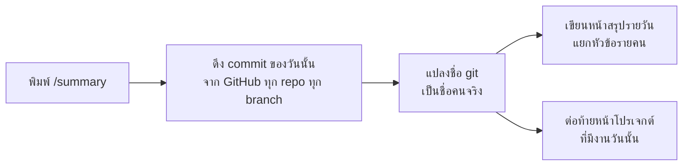

# คำสั่ง /summary — สรุปงานรายวันของทั้งทีมลง ProjectManagement

คำสั่งลัดใน Claude Code ที่สรุปงานทั้งวันของทุกโปรเจกต์ แยกว่าใครทำอะไร
แล้วเขียนลงแอป ProjectManagement ให้อัตโนมัติ — ตั้งค่าครั้งเดียวต่อเครื่อง

|                |                                                       |
| -------------- | ----------------------------------------------------- |
| เวอร์ชันเอกสาร | 2026-08-24                                            |
| ชั้นเอกสาร     | C                                                     |
| เจ้าของ        | Tech lead                                             |
| ไฟล์คำสั่ง     | `.claude/commands/summary.md` (ในโปรเจกต์นี้)         |
| แหล่งความจริง  | ตัวคำสั่งเอง — เอกสารนี้อธิบาย ไม่ใช่กำหนดพฤติกรรม   |

> **ต้นฉบับอยู่ที่นี่** ส่วนหน้าในแอป ProjectManagement (`pmPageId` ข้างบน) คือสำเนา
> สำหรับคนที่ไม่ได้เปิด repo — แก้ที่นี่แล้วต้องไปอัปเดตหน้านั้นด้วย

---

## มันทำอะไร



**อ่านจาก GitHub API ไม่ใช่จาก git ในเครื่อง** — จึงเห็นงานของทุกคนที่ push แล้ว
ไม่ว่าเครื่องที่รันจะ clone repo ไหนไว้บ้าง ทุกคนในทีมรันแล้วได้ผลเหมือนกัน

> **ทำไมไม่อ่าน git ในเครื่อง** — เคยทำแบบนั้นแล้วพลาดจริง: 2026-08-24 งานของทินกร
> ที่ push ไว้ตอน 09:12 ไม่โผล่ในสรุป เพราะเครื่องที่รันยังไม่ได้ pull ลงมา
> `git log` เห็นแค่สิ่งที่อยู่ในเครื่องแล้วเท่านั้น

---

## สิ่งที่ต้องมี

| ต้องมี                       | ทำไม                     | ติดตั้ง / ตรวจ                              |
| ---------------------------- | ------------------------ | ------------------------------------------- |
| Claude Code                  | ตัวรันคำสั่ง             | —                                           |
| **GitHub CLI** (`gh`)        | ดึง commit จาก GitHub    | `winget install --id GitHub.cli` · `gh --version` |
| สิทธิ์เข้าถึง repo ของทีม    | repo อยู่ใต้ `akkdach`   | ต้องถูกเชิญเข้า repo แล้ว                   |
| MCP ต่อกับแอป                | ใช้เขียนผลลงแอป          | ดู `docs/RB-connect-ai.md`                  |

---

## ตั้งค่าครั้งแรก (ต่อเครื่อง)

### 1. ติดตั้ง GitHub CLI

```powershell
winget install --id GitHub.cli
```

**ปิด terminal แล้วเปิดใหม่** หลังติดตั้ง ไม่งั้นยังหาคำสั่ง `gh` ไม่เจอ

### 2. ล็อกอิน GitHub

```powershell
gh auth login
```

ตอบตามลำดับ: **GitHub.com** → **HTTPS** → **Login with a web browser** →
คัดลอกรหัส 8 หลัก → Enter → เบราว์เซอร์เปิด → วางรหัส → Authorize

ตรวจ: `gh auth status` ต้องขึ้น `Logged in to github.com as <ชื่อ>`

> ⚠️ ขั้นนี้ **AI ทำแทนไม่ได้** — ต้องยืนยันตัวตนผ่านเบราว์เซอร์ด้วยตัวเอง

### 3. ติดตั้งตัวคำสั่ง — เลือกทางใดทางหนึ่ง

| ทาง | ทำยังไง | ใช้ได้เมื่อไหร่ |
| --- | --- | --- |
| **project scope** (ไม่ต้องทำอะไร) | clone repo นี้ก็ได้ไปเลย | เฉพาะตอนเปิด Claude Code ในโฟลเดอร์ repo นี้ |
| **user scope** | copy `.claude/commands/summary.md` ไปที่ `%USERPROFILE%\.claude\commands\` | ทุกโฟลเดอร์บนเครื่องนั้น |

```powershell
# ทาง user scope
New-Item -ItemType Directory -Force "$env:USERPROFILE\.claude\commands" | Out-Null
Copy-Item .claude\commands\summary.md "$env:USERPROFILE\.claude\commands\"
```

⚠️ ทาง user scope เป็น **สำเนา** — แก้ไฟล์ในโปรเจกต์แล้วต้อง copy ทับใหม่

### 4. ปิด Claude Code แล้วเปิดใหม่

จำเป็น — Claude Code อ่านรายการคำสั่งตอนเริ่มทำงานเท่านั้น

---

## วิธีใช้

| พิมพ์                  | ได้อะไร                  |
| ---------------------- | ------------------------ |
| `/summary`             | สรุปงาน **วันนี้**       |
| `/summary 2026-08-23`  | สรุปย้อนหลังวันที่ระบุ   |

**ควรรันท้ายวันหลังทุกคน push แล้ว** — รันตอนเช้าจะได้ภาพไม่ครบ

---

## ผลลัพธ์

- **หน้าสรุปรายวัน** ใต้ `📓 สรุปงานรายวัน` — ภาพรวม → แยกหัวข้อรายคนพร้อมเวลา →
  บั๊กสำคัญติด 🔴 พร้อมอาการและสาเหตุ → รายการค้าง
- **หน้าโปรเจกต์แต่ละตัว** — ต่อท้าย "อัปเดต \<วันที่\>" แยกชื่อคนข้างใน

มีหน้าของวันนั้นอยู่แล้ว → อ่านของเดิมก่อนแล้วเขียนทับ **ไม่สร้างซ้ำ**

---

## ชื่อคนมาจากไหน

จาก **git author ของแต่ละ commit** แล้วแปลงผ่านตารางในตัวคำสั่ง

⚠️ **ต้องดูทั้งชื่อและอีเมลคู่กัน** — ทีมนี้มีกรณีอีเมลเดียวกันแต่คนละคน:
`akkdach@gmail.com` ถูกใช้ทั้งโดย `unit7761-cpu` (= Ronnachai) และ `Akkdach` (= อรรคเดช)
ดูแค่อีเมลจะแยกไม่ออก

เจอชื่อที่ไม่อยู่ในตาราง **AI จะถามก่อน ไม่เดา** แล้วเติมลงตารางให้

**ทำให้แม่นขึ้นถาวร** — ให้ทุกคนตั้ง git ในเครื่องตัวเองให้ตรงคน:

```powershell
git config --global user.name "ชื่อจริง"
git config --global user.email "อีเมลบริษัท"
```

---

## ข้อจำกัด

| ไม่เห็นอะไร                                 | ทำไง                                    |
| ------------------------------------------- | --------------------------------------- |
| งานที่ commit แล้วแต่ **ยังไม่ push**       | push ก่อนรันคำสั่ง                      |
| งานที่ **ไม่ใช่โค้ด** (ประชุม ตรวจระบบ)     | เขียนเพิ่มเอง หรือบอก AI ให้เติม        |
| repo ที่ **ไม่ได้อยู่ใต้บัญชี `akkdach`**   | ยังไม่รองรับ — ต้องแก้ `$owner` ในคำสั่ง |

---

## แก้ปัญหา

| อาการ                                       | วิธีแก้                                                        |
| ------------------------------------------- | -------------------------------------------------------------- |
| `Unknown command: /summary`                 | ยังไม่ได้ติดตั้งคำสั่ง หรือยังไม่ได้ปิด-เปิด Claude Code ใหม่ |
| `gh: command not found`                     | ยังไม่ได้ติดตั้ง หรือยังไม่ได้เปิด terminal ใหม่หลังติดตั้ง   |
| `You are not logged into any GitHub hosts`  | รัน `gh auth login`                                            |
| สรุปไม่มีงานของบางคน                        | คนนั้นยังไม่ push · หรือ repo อยู่นอกบัญชี `akkdach`          |
| ชื่อคนผิด                                   | บอก AI ให้แก้ — จะแก้ทั้งตาราง mapping และหน้าที่เขียนไปแล้ว  |
| AI ถามว่า "ชื่อนี้คือใคร"                   | ตอบไป แล้วมันจะจำไว้ในตาราง ไม่ถามซ้ำ                          |
